# Spec Index and Integration Contract

This is the planning control plane for specs and the integration contract
that defines how approved specs compose into a coherent system. If we are
deciding what ships next, this file is the first stop. If we are building
a spec, this file defines how it connects to everything else.

Source of truth for dependency metadata:
- `docs/specs/dependencies.yaml`

Conceptual north stars:
- `docs/KNOWLEDGE-ARCHITECTURE.md`
- `docs/NORTH-STAR-ONTOLOGY.md`

---

## System Graph

```mermaid
flowchart TD
  MP[Memory Pipeline v2 ✓]
  SCP[Session Continuity ✓]
  PM[Procedural Memory]
  MA[Multi-Agent Support]
  KA[Knowledge Architecture ✓]
  PMS[Predictive Memory Scorer]
  SR[Signet Runtime]
  DP[Desire Paths Epic]
  OEC[Ontology Evolution Core]
  OGW[Ontology Governance Workflow]
  OPL[Ontology Proposal Loop]
  SSF[SSM Foundation Eval]
  EIPT[Engram-Informed Predictor Track]
  SST[SSM Temporal Backbone]
  SSG[SSM Graph Traversal Model]
  DRR[Daemon Rust Rewrite]
  PAF[Predictor Agent Feedback]
  SACC[Sub-Agent Context Continuity]
  DMC[Dreaming Memory Consolidation]

  subgraph W9[Wave 9 Strategic Stubs]
    DHO[Distributed Harness Orchestration]
    SNH[Signet Native Harness]
    RRP[Remember/Recall Skill Parity]
    RDC[Rust Daemon Parity Cutover]
    DMS[Deep Memory Search]
    MCB[MCP CLI Bridge + Usage Analytics]
    GMM[Git Marketplace Monorepo]
    ASL[Adaptive Skill Lifecycle]
    CIR[Cryptographic Identity Roadmap]
    CPY[Connector: Py Agent]
    CHA[Connector: Hermes Agent]
    CFC[Connector: ForgeCode]
    PAPI[Plugin API Ecosystem]
    CUV[Constellation Unified Viewer]
    DIR[Dashboard IA Refactor]
    PIA[Post-Install Migration Audit]
  end

  MP --> SCP
  MP --> PM
  MP --> KA
  MP --> SR
  SCP --> KA
  PM --> KA
  KA --> PMS
  SCP --> PMS
  MP --> PMS
  KA --> DP
  PMS --> DP
  KA --> OEC
  DP --> OEC
  OEC --> OGW
  KA --> OPL
  DMC -.-> OPL
  PMS --> SSF
  DP --> SSF
  PMS --> EIPT
  SSF -.-> EIPT
  DP -.-> EIPT
  EIPT --> SST
  SSF --> SST
  OEC --> SST
  SST --> SSG
  KA --> SSG
  DP --> SSG
  MA -.-> PM
  MA -.-> KA
  SR -.-> PM
  SR -.-> KA
  OGW -.-> OEC
  OGW -.-> DP
  SCP --> SACC
  MA --> SACC
  KA -.-> SACC

  MP --> DMC
  KA --> DMC
  SCP -.-> DMC

  MA --> DHO
  SR --> DHO
  DHO --> SNH
  SR --> SNH
  PM --> RRP
  DRR --> RDC
  MP --> RDC
  DP --> DMS
  SSF --> DMS
  SR --> MCB
  PAF --> GMM
  PM --> ASL
  PAF --> ASL
  MA --> CIR
  SR --> CPY
  SR --> CHA
  SR --> CFC
  SR --> PAPI
  KA --> CUV
  SR --> DIR
  MP --> PIA
```

Solid arrows = hard dependency. Dashed = integration contract (can build
in parallel, interfaces must align before merge).

---

## Research Provenance

Research documents inform spec design. Every spec traces back to the
research that shaped it. Research lives in `docs/research/` (technical
and market subdirectories). Reference repos live in `references/`.

| Spec ID | Informed By | Key Question |
|---|---|---|
| `memory-md-rolling-window-lineage` | RESEARCH-MEMORY-MD-ROLLING-WINDOW-LINKAGE, RESEARCH-LCM-ACP | How should MEMORY.md treat markdown summaries/transcripts/compactions as canonical history while keeping a strict rolling 30-day per-session ledger? |
| `knowledge-architecture-schema` | RESEARCH-GITNEXUS-PATTERNS, RESEARCH-LCM-ACP | How should entities, aspects, and attributes be structured? |
| `knowledge-architecture-navigation` | RESEARCH-KNOWLEDGE-GRAPH-NAVIGATION | How should agents browse large structured memory graphs without dumping the whole graph into context? |
| `desire-paths-epic` | RESEARCH-LCM-ACP, RESEARCH-REFERENCE-REPOS | How does retrieval evolve from flat search to graph traversal? |
| `predictive-memory-scorer` | MSAM-COMPARISON | How should scoring balance structural vs behavioral signals? |
| `desire-paths-epic`, `retroactive-supersession` | RESEARCH-COMPETITIVE-SYSTEMS | What retrieval, lifecycle, and integration patterns from competing systems should be adopted? |
| `ontology-evolution-core`, `ontology-governance-workflow` | RESEARCH-ONTOLOGY-EVOLUTION | How should ontology schema and governance evolve without losing local-first simplicity? |
| `ontology-proposal-loop` | RESEARCH-ONTOLOGY-EVOLUTION, memory-md-rolling-window-lineage, dreaming-memory-consolidation, model-provider-router | How should extraction and consolidation propose ontology changes without directly mutating semantic state? |
| `ssm-foundation-evaluation`, `ssm-temporal-backbone`, `ssm-graph-traversal-model` | RESEARCH-SSM-INTEGRATION, SSM-GRAPH-INTERSECTION, SSM-LITERATURE-REVIEW, SYNTHETIC-DATA-GENERATION | How should SSM research translate into benchmarked, staged deployment without violating retrieval invariants? |
| `engram-informed-predictor-track` | arxiv:2601.07372, RESEARCH-SSM-INTEGRATION, ssm-foundation-evaluation | How should Engram design patterns be translated into Signet scorer and SSM architecture decisions? |
| `macos-sqlite-runtime-discovery` | RESEARCH-MACOS-SQLITE-RUNTIME-DISCOVERY | How should Signet select a compatible SQLite runtime on macOS so Bun can load sqlite-vec? |
| `docker-self-hosting-stack` | RESEARCH-DOCKER-SELF-HOSTING | What deployment contract keeps Docker self-hosting reproducible, persistent, and secure by default? |
| `openclaw-workspace-protection-plan`, `openclaw-workspace-protection` | RESEARCH-OPENCLAW-WORKSPACE-PROTECTION | How should Signet prevent data loss when OpenClaw uninstall deletes a workspace that points at `.agents`? |
| `dogfood-hardening-2026-03-29` | RESEARCH-DOGFOOD-HARDENING-2026-03-29 | Which runtime, MCP, and knowledge-surface regressions from the March 29, 2026 dogfood run need durable hardening? |
| `marketplace-official-skills` | RESEARCH-MARKETPLACE-OFFICIAL-SKILLS | How should the dashboard marketplace spotlight Signet official skills without hiding the broader community catalog? |
| `markdown-embedding-normalization-hardening` | RESEARCH-MARKDOWN-EMBEDDING-NORMALIZATION | How should Signet preserve structured markdown for embeddings while preventing repeated poison-pill retries from malformed or provider-sensitive payloads? |
| `connector-forgecode` | RESEARCH-REFERENCE-REPOS | How should Signet bridge its portable identity, skills, and MCP surfaces into ForgeCode's `~/forge` environment without relying on unavailable lifecycle hooks? |
| `dreaming-memory-consolidation` | LCM-PATTERNS, memory-pipeline-plan, knowledge-architecture-schema | How should Signet consolidate accumulated session knowledge into a cleaner entity graph during idle periods? |
| `native-harness-memory-bridge` | RESEARCH-NATIVE-HARNESS-MEMORY-BRIDGE | How should Signet make harness-native memories portable without duplicating each harness's memory pipeline? |
| `model-provider-router` | RESEARCH-INFERENCE-CONTROL-PLANE, RESEARCH-COMPETITIVE-SYSTEMS | How should Signet centralize inference across harnesses, daemon workloads, and heterogeneous provider backends under one policy surface? |

### Research Adoption Ledger (high-impact)

| Research Doc | Program Decision | Mapped To |
|---|---|---|
| `RESEARCH-COMPETITIVE-SYSTEMS` | ADOPT (tiered) | `desire-paths-epic`, `retroactive-supersession`, `ontology-evolution-core` |
| `RESEARCH-GITNEXUS-PATTERNS` | ADOPT (selective) | KA traversal hardening, DP bounded traversal, ontology confidence/provenance |
| `RESEARCH-REFERENCE-REPOS` | ADOPT/TEST | DP-16..DP-20 design direction |
| `RESEARCH-SSM-INTEGRATION` | ADOPT (planning track active) | `ssm-foundation-evaluation`, `ssm-temporal-backbone` |
| `SSM-GRAPH-INTERSECTION` | ADOPT (planning track active) | `ssm-graph-traversal-model` |
| `arxiv:2601.07372 (Engram)` | ADOPT (translation track) | `engram-informed-predictor-track`, SSM planning contracts |
| `RESEARCH-DOCKER-SELF-HOSTING` | ADOPT (planning track active) | `docker-self-hosting-stack` |

---

## Cross-Cutting Invariants

These rules apply to ALL approved specs. Any spec that contradicts
these must be updated to conform.

### 1. Agent scoping is universal

Every table that stores user-facing data MUST include an `agent_id`
column. Nothing is global by default. Multi-agent support is not an
afterthought — it is a first-class column from day one.

Tables affected: `memories`, `entities`, `entity_aspects`,
`entity_attributes`, `entity_dependencies`, `skill_meta`, `task_meta`,
`session_checkpoints`, `session_memories`, `predictor_comparisons`.

Note: `entities` (migration 002) predates this invariant and does not
yet have `agent_id`. Migration 019 (KA-1) backfills it. `skill_meta`
(migration 018) already has `agent_id`.

Scoping rule: queries filter by `agent_id` unless explicitly requesting
cross-agent results (e.g., shared skill lookup with allowlist).

The `agent_id` column is infrastructure for database-level tenant
isolation, not a knowledge architecture concern. It exists on every
table for the same reason: so multiple agents sharing the same SQLite
file don't step on each other's data.

Skills are scoped to `agent_id` in the graph. The filesystem pool
(`$SIGNET_WORKSPACE/skills/`) is shared, but graph nodes (entity + skill_meta +
embeddings) are per-agent. Each agent gets its own skill entity with its
own usage stats, decay, and relation edges.

### 2. Importance is structural, not arbitrary

`docs/KNOWLEDGE-ARCHITECTURE.md` is authoritative on importance.

Importance is NOT a float assigned by heuristic. It is computed from
structural density:
- Entity importance = f(aspect count, attribute count, constraint count,
  dependency edges, access frequency, user-implied signals)
- Aspect weight = f(attribute density, constraint density, access
  patterns)
- The predictive scorer receives structural density as input features,
  not a pre-computed importance float

The existing `importance` column on `memories` remains for backwards
compatibility and cold-start scoring, but the structural computation
is the source of truth once KA tables are populated.

### 3. Entity type taxonomy is canonical

The knowledge architecture schema defines the canonical entity types:
`person`, `project`, `system`, `tool`, `concept`, `skill`, `task`,
`source`, `artifact`, `agent`, `policy`, `action`, `workflow`, `event`,
`object_type`, `interface`, `observation`, `claim_slot`, `claim_value`,
`unknown`.

All specs that create entities MUST use this taxonomy. Procedural memory
creates `entity_type = 'skill'`. Multi-agent creates agent-scoped
entities. The ontology proposal loop extends KA's canonical taxonomy with
source/proposal lifecycle labels so extraction can model artifacts,
observations, claim slots, and claim values without minting ad-hoc string
categories. The taxonomy is not extensible without updating KA and this
invariant in the same change.

**Planned extension:** DP-14 (Discovered Principles) in the desire
paths epic will add `principle` as an entity type for emergent
cross-entity patterns. This invariant must be updated when DP-14
lands.

### 4. Scorer consumes all available signals

The predictive memory scorer takes every input that exists. Structural
features from KA (entity slot, aspect slot, is_constraint, structural
density), procedural signals (skill usage, decay rate, role), continuity
signals (checkpoint recency, prompt count), behavioral signals (FTS
hits, access patterns), temporal signals (time of day, day of week,
session gap).

More inputs with verifiable grading is always better than curated
inputs. The model learns to ignore irrelevant features. The metric
(NDCG@10 on continuity scores) is the arbiter.

### 5. Constraints always surface

When an entity is in scope during a session, its constraints
(`entity_attributes` where `kind = 'constraint'`) are injected
regardless of score rank. The predictive scorer may rank them but
cannot suppress them. This is a hard retrieval invariant.

---

## Integration Contracts

### Procedural Memory <-> Knowledge Architecture

- Procedural memory creates skill entities with `entity_type = 'skill'`
  and `skill_meta` for runtime behavior (decay rate, use count, fs path,
  role, triggers).
- Knowledge architecture adds `entity_aspects` and `entity_attributes`
  on top. Skills can have aspects (e.g., "deployment capabilities",
  "browser automation features") and attributes organized under those
  aspects.
- KA's `entity_dependencies` captures structural edges between skills
  and other entities (e.g., `skill:wrangler` -> `entity:cloudflare`).
  Procedural memory's `relations` table captures skill-to-skill edges
  (`requires`, `complements`, `often_used_with`).
- Both coexist. `relations` is for skill-specific typed edges.
  `entity_dependencies` is for cross-type structural edges.
- KA structural assignment stage runs AFTER procedural memory creates
  the skill entity. It enriches with aspects/attributes, it does not
  replace skill_meta.

### Procedural Memory <-> Predictive Scorer

- Scorer pre-filter must respect procedural decay rates (`0.99^days`
  with `minImportance` floor) when computing `effectiveScore()` for
  skill-type memories.
- Scorer feature payload includes: `decay_rate`, `use_count`,
  `last_used_at`, `role`, `is_skill` indicator.
- Skills with `minImportance` floor cannot be eliminated during
  pre-filtering. They may rank low but must remain in the candidate
  pool.

### Knowledge Architecture <-> Predictive Scorer

- Traversal-defined candidate pool is the primary retrieval floor.
  Scorer operates on `traversal pool ∪ effectiveScore top-50 ∪
  embedding top-50`.
- Structural features per candidate: `entity_slot` (hashed entity ID),
  `aspect_slot` (hashed primary aspect), `is_constraint` (boolean),
  `structural_density` (aspect count + attribute count for the parent
  entity).
- Scorer evaluation reports include per-entity and per-project slices,
  not only global EMA.
- **Feedback direction (KA-6):** Behavioral signals flow BACK to the
  graph. FTS overlap (memories the user searched for during a session)
  feeds back to aspect weights, confirming which structural bets paid
  off. Per-entity predictor win rates surface as graph health signals.
  Superseded memory labels propagate to entity_attributes status.
  Without this feedback loop, structural weights stagnate and the
  graph diverges from what the user actually needs.
- **Entity pinning (KA-6):** Users can pin entities as always-focal,
  front-loading importance before behavioral evidence accumulates.
  Pinned entities are training data for the predictor — the manual
  exploration mechanism that the predictor eventually learns to
  replicate autonomously. See `docs/KNOWLEDGE-ARCHITECTURE.md`
  section "Love, Hate, and the Exploration Problem" for rationale.

### Knowledge Architecture <-> Session Continuity

- Checkpoint digests include optional structural snapshot: focal
  entities, active aspects, surfaced constraints.
- Recovery injection prioritizes structural snapshots over raw narrative
  when budget is tight.
- Continuity scorer label quality improves when session-end evaluation
  knows which constraints and aspects were in play.

### Signet Runtime <-> Procedural Memory

- Runtime context assembly calls `/api/skills/suggest` (from procedural
  memory spec) to surface relevant skills during session-start and
  optionally per-turn.
- Runtime tool registry discovers installed skills. When a skill is
  invoked, runtime calls `POST /api/skills/used` to record usage.
- Runtime pre-generation research phase may query skill graph for
  domain-relevant capabilities before model generation.

### Signet Runtime <-> Knowledge Architecture

- Runtime session-start calls the traversal retrieval path (KA-3) to
  resolve focal entities and walk their graphs for context assembly.
- Runtime provides project path and session signals that KA uses to
  resolve focal entities.
- Runtime does not implement traversal logic — it calls daemon API
  endpoints that KA defines.

### Desire Paths <-> Knowledge Architecture

- Desire paths builds on the complete KA-1 through KA-6 foundation:
  entity/aspect/attribute hierarchy, graph traversal, behavioral
  feedback loop, entity pinning, constraint surfacing.
- DP-2 (edge confidence) adds `confidence` and `reason` columns to
  `entity_dependencies`. Graph traversal uses `confidence * strength`
  for edge filtering.
- DP-6 (traversal-primary retrieval) inverts the search pipeline so
  graph traversal produces the base candidate pool and flat FTS5 search
  fills gaps. Includes: FTS5 stop-word filtering, agent_id threading
  through graph search, mention-based traversal fallback for memories
  without full pipeline extraction, scope-filtered attribute collection,
  prospective indexing (hypothetical query hints written at memory
  creation time for future retrieval), and cosine re-scoring of
  traversal results against the query embedding. Benchmarked at 62%
  (Signet) vs 68% (RAG) on identical 50-question LoCoMo set — 8 of 12
  Signet failures are shared with RAG (extraction/answer ceiling, not
  retrieval).
- DP-7 (constructed memories) changes traversal output from
  `memoryIds` to structured path objects with provenance metadata.
- DP-14 (discovered principles) adds `principle` to the entity type
  taxonomy. Requires updating invariant 3 when implemented.
- DP-16 (post-fusion dampening) adds gravity, hub, and resolution
  filters after fusion scoring. Informed by Ori-Mnemos ablation data.
  Implemented in `platform/daemon/src/pipeline/dampening.ts`.
- DP-17 (compaction resilience) adds PreCompact/PostCompact checkpoint
  hooks for mid-session context recovery. Extends session continuity.
- DP-18 (decision auto-protection) auto-detects decisions and marks
  them as constraints (invariant 5 ensures they always surface).
  Implemented in `platform/daemon/src/inline-entity-linker.ts` (14
  regex patterns, auto-promotes matching attributes to constraints).
- DP-19 (adaptive write gate) evolves DP-1 significance gate from
  session-level to per-memory surprisal filtering.
- DP-20 (sleep replay) background consolidation discovers latent
  cross-entity connections during idle periods.

### Desire Paths <-> Predictive Scorer

- DP-8 (predictor bug fixes) is a prerequisite: fixes the 3 critical
  bugs blocking enablement.
- DP-10 (path scoring) evolves the scorer from ranking individual
  memories to ranking traversal paths. Feature vector changes from
  per-memory signals to per-path signals (hop count, min edge
  confidence, average aspect weight, community boundary crossing).
- DP-9 (path feedback) changes training signal from "was this memory
  useful?" to "was this traversal path useful?" — propagating ratings
  along edges, upgrading/downgrading confidence/reason.
- This is the convergence point described in `docs/specs/planning/DESIRE-PATHS.md`:
  the scorer provides learning signal, the graph provides structure
  to propagate it.

### Ontology Evolution Core <-> Desire Paths

- Traversal ranking consumes `confidence`, `reason`, and co-occurrence
  association signals where present, with bounded fallback to existing
  confidence-strength scoring when absent.
- Typed relationship taxonomy is introduced behind compatibility mapping;
  legacy edges remain queryable until strict mode is enabled.
- Constraint surfacing invariant remains a hard override regardless of
  ontology edge rank.

### Ontology Evolution Core <-> Retroactive Supersession

- Attribute supersession and memory lineage stay synchronized: when a new
  fact supersedes an old fact, latest-truth retrieval prefers the newest
  node while preserving full chain expansion for audit/history.
- Constraints (`kind='constraint'`) are excluded from auto-supersession,
  unchanged from invariant 5.

### Ontology Governance Workflow <-> INDEX / CI

- Any ontology-impacting schema PR must update: spec file, `dependencies.yaml`,
  and this index registry in the same change.
- CI contract checks block merge on ID/status/path drift between INDEX and
  dependencies metadata.
- Medium/high-risk ontology changes require explicit compatibility and rollback
  notes before promotion from planning to approved.

### SSM Track <-> Retrieval and Ontology Contracts

- `ssm-foundation-evaluation` defines benchmark and canary gates. No SSM
  routing may become default until these gates are green and repeatable.
- `ssm-temporal-backbone` runs in shadow mode first. Production retrieval
  remains deterministic with existing scorer fallback.
- `ssm-graph-traversal-model` may re-rank traversal paths but cannot alter
  traversal bounds, agent scoping, or constraint surfacing invariants.
- SSM features consume ontology signals (`confidence`, relationship type,
  co-occurrence, lineage) when available. `ontology-evolution-core` is a
  soft dependency for `ssm-temporal-backbone` and `ssm-graph-traversal-model`
  (both handle missing signals gracefully with zero defaults) and is not
  required by `ssm-foundation-evaluation`.

### Engram-Informed Predictor Track <-> SSM Track

- `engram-informed-predictor-track` is the translation lane for Engram
  patterns into Signet scorer experiments and SSM-ready contracts.
- No `ssm-temporal-backbone` rollout may claim Engram alignment until this
  track records accepted/rejected deltas and benchmark evidence.
- The track cannot violate existing runtime guarantees: fail-open scoring,
  deterministic fallback, bounded latency, and constraint surfacing.

### Dreaming Memory Consolidation <-> Knowledge Architecture

- Dreaming reads the full entity graph (entities, aspects, attributes,
  dependencies) as input to reasoning passes.
- Dreaming writes graph mutations through the same KA schema: creates,
  merges, deletes entities; updates/deletes aspects; supersedes/creates/
  deletes attributes; rewrites dependency edges during merges.
- Pinned entities (KA-6) cannot be deleted by dreaming — enforced at
  mutation application time, reported as `skipped`.
- Constraint attributes (`kind='constraint'`) cannot be superseded or
  deleted by dreaming — invariant 5 holds.
- Dreaming does not modify memories, embeddings, or retention state.
  It only mutates the entity graph layer.

### Dreaming Memory Consolidation <-> Session Continuity

- Dreaming token accumulation hooks into the summary worker: each
  session summary's transcript token count feeds `dreaming_state`.
- Phase 2 will make dreaming passes into real sessions (session-start,
  transcript, session-end summary), creating a self-improvement loop
  where dream pass N+1 can review dream pass N's decisions.
- Until Phase 2, dreaming passes are standalone LLM calls with no
  session continuity or memory of prior passes.

### Dreaming Memory Consolidation <-> Pipeline V2

- Phase 1: dreaming and Pipeline V2 can run concurrently. SQLite write
  serialization prevents data corruption but not logical inconsistency
  (extraction may create entities between dreaming's read and write).
- Phase 2 contract: when `dreaming.enabled: true`, Pipeline V2
  extraction workers should be OFF. One knowledge graph writer at a
  time. Summary workers and retention continue regardless.
- Pipeline V2 remains the default for users without dreaming configured.
  Dreaming is opt-in and requires a capable model provider.

### Multi-Agent <-> All Specs

- `agent_id` column appears on every data table (see invariant 1).
- Agent roster in `agent.yaml` under `agents.roster` defines which agents exist.
- Identity inheritance: agent subdirs (`~/.agents/agents/{name}/`) override
  root-level files. Only `SOUL.md` and `IDENTITY.md` are per-agent by default;
  `AGENTS.md`, `USER.md`, `TOOLS.md` inherit from root.
- Skills: shared filesystem pool, per-agent graph nodes and usage stats.
- Memory queries include agent scope filter based on per-agent read policy:
  - `isolated`: only own memories
  - `shared`: all `visibility=global` memories + own private
  - `group`: `visibility=global` from group members + own private
- `visibility` column on `memories` (`global`/`private`/`archived`) is the
  per-memory access flag. Separate from `scope` (benchmark namespacing).
- OpenClaw session key format `agent:{id}:{rest}` is auto-parsed by
  `resolveAgentId()` — no extra config needed for OpenClaw users.
- The daemon serves both single-agent and multi-agent installs. All new
  API params are optional with sensible defaults (no `agentId` =
  `"default"` agent = current single-agent behavior).

---

## Build Sequence

Phase ordering based on hard dependencies and integration contracts.

### Wave 1 (parallel, no cross-dependencies)

- **Procedural Memory P1**: schema + enrichment + node creation
  - Creates `skill_meta` table, skill entities, frontmatter enrichment
  - Unblocks KA structural assignment
- **Signet Runtime Phase 1**: scaffold + CLI channel
  - Independent of cognition stack, talks to daemon API only
- **Multi-Agent Phase 1-8**: IN PROGRESS (2026-03-24)
  - Phase 1: `AgentDefinition` type + `agents.roster` in `AgentManifest` — DONE
  - Phase 2: `platform/core/src/agents.ts` — discovery, scaffold, identity inheritance — DONE
  - Phase 3: Migration 043 — `agents` table + `memories.agent_id` + `memories.visibility` — DONE
  - Phase 4: Daemon — scope clause, `/api/agents` endpoints, `agent-id.ts` — DONE
  - Phase 5: File watcher — watches `~/.agents/agents/` subdirectories — DONE
  - Phase 6: Harness sync — per-agent workspace dirs for OpenClaw — DONE
  - Phase 7: CLI — `signet agent` subcommand + `--agent`/`--private` flags — DONE
  - Phase 8: OpenClaw connector — `syncMultipleAgents()` + session key auto-parse — DONE
  - Extended: per-agent read policy (isolated/shared/group) with `visibility` column
  - Deferred: Phase 9 (dashboard), Phase 10 (setup wizard)

### Wave 2 (depends on Wave 1)

- **Knowledge Architecture KA-1 + KA-2**: schema + structural assignment — COMPLETE
  - Requires skill entities from procedural memory P1
  - Adds `entity_aspects`, `entity_attributes`, `entity_dependencies`,
    `task_meta`
  - Structural assignment stage in extraction pipeline
- **Procedural Memory P2**: usage tracking + linking
  - Parallel with KA-2
- **Predictive Scorer Phase 0**: data pipeline prerequisites
  - `session_memories` table, improved continuity scoring
  - Can start parallel with KA work

### Wave 3 (depends on Wave 2)

- **Knowledge Architecture KA-3**: traversal retrieval path — COMPLETE
  - Wires session-start and recall to include traversal candidates
  - Enforces constraint surfacing invariant
- **Predictive Scorer Phase 1**: Rust crate scaffold + autograd
  - Parallel with KA-3
- **Procedural Memory P3**: implicit relation computation
  - Needs usage data from P2

### Wave 4 (depends on Wave 3)

- **Knowledge Architecture KA-4**: predictor coupling — COMPLETE
  - Structural features in scorer payload
- **Predictive Scorer Phase 2-3**: training pipeline + daemon integration
  - Requires KA structural features
- **Procedural Memory P4**: retrieval and suggestion endpoints
- **Signet Runtime Phase 2**: built-in tools + pre-generation phase

### Wave 5 (polish + feedback)

- **Procedural Memory P5**: dashboard visualization
- **Predictive Scorer Phase 4**: observability + dashboard
- **Knowledge Architecture KA-5**: continuity + dashboard — COMPLETE
- **Knowledge Architecture KA-6**: entity pinning + behavioral feedback loop — COMPLETE
  loop (FTS overlap → aspect weight, aspect decay, per-entity health,
  superseded propagation). See `docs/KNOWLEDGE-ARCHITECTURE.md` section
  "Love, Hate, and the Exploration Problem" for rationale.
- **Signet Runtime Phase 3**: HTTP channel + adapter retrofit
- **Multi-Agent Phase 4+**: daemon API, harness sync, CLI, dashboard

### Wave 6 (depends on Wave 5 — KA complete, PMS complete)

- **Desire Paths Phase 1**: foundation completion
  - DP-1: Significance gate (zero-cost continuity) — COMPLETE
  - DP-2: Edge confidence + reason on `entity_dependencies` — COMPLETE
  - DP-3: Bounded traversal parameters — COMPLETE
  - DP-4: MCP tool registration + blast radius endpoint — COMPLETE
- **Desire Paths Phase 2**: bootstrap topology
  - DP-5: Louvain community detection — COMPLETE
- **Desire Paths Phase 3**: graph-native retrieval
  - DP-6: Entity-anchored search + traversal-primary retrieval — COMPLETE
  - DP-7: Constructed memories with path provenance — COMPLETE
  - DP-6.1: Prospective indexing (hypothetical query hints at write time) — COMPLETE
  - DP-6.2: Cosine re-scoring for traversal results — COMPLETE
  - DP-6.3: Scoped vector search restore with 2x over-fetch — COMPLETE
- **Benchmark baseline (2026-03-20, updated 2026-03-21)**: 50-question
  LoCoMo comparison on identical question sets. Signet 62% vs RAG 68%
  at initial baseline. Post DP-6.1/6.2/6.3: prospective indexing
  improves hint-based retrieval for previously missed queries, cosine
  re-scoring reranks traversal candidates by semantic relevance, and
  scoped vector search with 2x over-fetch restores embedding-based
  recall within entity scope. 8 of 12 original Signet failures are
  shared with RAG — extraction/answer ceiling, not retrieval.
- **Full-stack benchmark (2026-03-22)**: 8-question LoCoMo with DP-16
  dampening, lossless session transcripts, gpt-4o extraction, and
  improved temporal rules. 87.5% accuracy (7/8), 100% Hit@10, MRR
  0.615. By type: multi-hop 100% (4/4), temporal 100% (1/1),
  single-hop 66.7% (2/3). Precision 26.3%, recall 100%, NDCG 0.639.
- **Desire Paths Phase 4**: path learning
  - DP-8: Predictor bug fixes (cache invalidation) — COMPLETE
  - DP-9: Path feedback propagation + co-occurrence growth + Q-value rewards — COMPLETE
  - DP-10: Path scoring (predictor evolution) — NOT STARTED
  - DP-11: Temporal reinforcement + intent-aware routing — NOT STARTED
- **Desire Paths Phase 5**: emergence
  - DP-12: Explorer bees — NOT STARTED
  - DP-13: Cross-entity bridges + reconsolidation — NOT STARTED
  - DP-14: Discovered principles — NOT STARTED
  - DP-15: Entity health dashboard — NOT STARTED
  - DP-16: Post-fusion dampening (gravity, hub, resolution) — COMPLETE
  - DP-17: Compaction resilience (hippocampal replay) — NOT STARTED
  - DP-18: Decision auto-protection — COMPLETE
  - DP-19: Adaptive write gate (per-memory surprisal) — PARTIALLY COMPLETE (prototype)
  - DP-20: Sleep replay (background consolidation) — NOT STARTED

### Wave 7 (ontology hardening and governance)

- **Ontology Evolution Core**: planning
  - confidence/provenance edge semantics
  - dynamic co-occurrence weighting + normalization
  - typed relationship taxonomy
  - temporal lineage support for current-truth retrieval
- **Ontology Governance Workflow**: planning
  - proposal/review gates for ontology-impacting schema changes
  - compatibility + rollback requirements
  - CI checks for INDEX/dependencies contract drift

### Wave 8 (SSM translation and shadow deployment)

- **SSM Foundation and Evaluation**: planning (`ssm-foundation-evaluation`)
  - reproducible benchmark harness + synthetic/real canaries
  - ablations against current scorer (NDCG@10, MRR, temporal precision)
- **Engram-Informed Predictor Track**: planning (`engram-informed-predictor-track`)
  - translate Engram hash/gate/conv patterns into Signet scorer experiments
  - publish acceptance/rejection contracts before temporal SSM rollout
- **SSM Temporal Backbone**: planning (`ssm-temporal-backbone`)
  - shadow-mode temporal sidecar with deterministic fallback
  - learned decay and continuity-aware ranking validation
- **SSM Graph Traversal Model**: planning (`ssm-graph-traversal-model`)
  - path-level SSM reranking in shadow mode
  - strict preservation of traversal bounds and constraint surfacing

### Wave 9 (strategic stub backlog, planning not complete)

- **Distributed Harness and Agent Orchestration** (`distributed-harness-orchestration`)
  - multi-remote harness management, multi-agent control, multi-memory backend topology
- **Signet Native Harness** (`signet-native-harness`)
  - first-party harness for benchmark parity and production-grade experimentation
  - reference inspiration: Hermes Agent
- **Remember/Recall Skill Parity Refresh** (`remember-recall-skill-parity`)
  - align `/remember` and `/recall` skills with current architecture/schema
- **Explicit Recall Surface Alignment** (`explicit-recall-surface-alignment`)
  - consolidate TypeScript explicit recall around one engine and one response contract
  - keep prompt-submit lightweight and stop consumer renderers from discarding metadata
- **Semantic Prospective Hints** (`semantic-prospective-hints`)
  - extend prospective indexing with hint embeddings and semantic recall over predicted future cues
- **Rust Daemon Parity and Runtime Cutover** (`rust-daemon-parity-cutover`)
  - parity completion and primary-runtime switch strategy
- **Deep Memory Search** (`deep-memory-search`)
  - optional multi-agent LLM memory search path (not primary retrieval)
- **MCP CLI Bridge and Usage Analytics** (`mcp-cli-bridge-and-usage-analytics`)
  - expose installed MCP servers as Signet CLI commands and track usage in dashboard
  - reference inspiration: MC Porter
- **Overview Usage Analytics** (`overview-usage-analytics`)
  - make the home overview card reflect real MCP server and skill usage
  - reuse analytics ledgers instead of catalog popularity
- **Git Marketplace Monorepo** (`git-marketplace-monorepo`)
  - GitHub-authenticated PR workflow for skills/servers and JSON review artifacts
- **Adaptive Skill Lifecycle** (`adaptive-skill-lifecycle`)
  - passive/continuous skill maintenance with outcome feedback loops
- **Marketplace Official Skills Featuring** (`marketplace-official-skills`)
  - dashboard browse UX that foregrounds Signet official skills without hiding the wider catalog
- **Cryptographic Identity Roadmap** (`cryptographic-identity-roadmap`)
- **Connector: Py Agent** (`connector-py-agent`)
- **Connector: Hermes Agent** (`connector-hermes-agent`)
- **Connector: Oh My Pi** (`connector-oh-my-pi`)
- **Plugin API and App Ecosystem** (`plugin-api-ecosystem`)
  - cross-surface plugin SDK and host for daemon, CLI, MCP, dashboard,
    connectors, SDK, and prompt lifecycle contributions
  - uses Signet Secrets as the reference privileged core plugin and provider
    architecture
- **Unified Constellation Viewer** (`constellation-unified-viewer`)
  - realtime unified constellation/embedding/entity view, replace slow 3D path
- **Dashboard IA Refactor** (`dashboard-information-architecture-refactor`)
  - settings as standalone page, breadcrumb-driven unified navigation model
- **Post-Install Behavior Migration Audit** (`postinstall-behavior-migration-audit`)
  - verify no critical install behavior relies on fragile post-install scripts
- **Docker Self-Hosting Stack** (`docker-self-hosting-stack`)
  - first-party image + compose stack with Caddy, persistent workspace volume, and team-mode bootstrap path

- **Explicitly dropped:** client-side LLM reranking (superseded by different solution)

### Wave 10 (CI/CD and workflow acceleration stubs)

- **CI Changed-Files Selective Pipelines** (`ci-changed-files-selective`)
- **CI Contract Invariants Lane** (`ci-contract-invariants-lane`)
- **CI Flaky Test Quarantine** (`ci-flaky-test-quarantine`)
- **PR Preview Environments** (`ci-pr-preview-environments`)
- **PR Risk Tier Policy** (`pr-risk-tier-policy`)
- **API Contract Snapshots** (`api-contract-snapshots`)
- **Developer Doctor Command** (`developer-doctor-command`)
- **Golden Path Contributor Docs** (`golden-path-docs`)
- **Code Ownership and Review SLA** (`code-ownership-sla`)
- **Release Train Cadence** (`release-train-cadence`)
- **Post-Merge Canary Suite** (`post-merge-canary-suite`)
- **Incident to Guardrail Loop** (`incident-guardrail-loop`)

---

## Spec Registry

Legend:
- `planning`: design in progress
- `approved`: accepted design, pending or partial implementation
- `complete`: delivered baseline or merged strategy
- `reference`: directional or notebook artifact, not an implementation contract

| ID | Status | Path | Hard Depends On | Blocks | Notes |
|---|---|---|---|---|---|
| `memory-pipeline-v2` | complete | `docs/specs/complete/memory-pipeline-plan.md` | - | `session-continuity-protocol`, `procedural-memory-plan`, `knowledge-architecture-schema`, `predictive-memory-scorer`, `signet-runtime` | Extraction and session-synthesis providers are separate surfaces; when `pipelineV2.synthesis` is omitted, runtime falls back to the resolved extraction provider/model instead of a hidden CLI default. |
| `session-continuity-protocol` | complete | `docs/specs/complete/session-continuity-protocol.md` | `memory-pipeline-v2` | `knowledge-architecture-schema`, `predictive-memory-scorer` | |
| `memory-md-temporal-head` | approved | `docs/specs/approved/memory-md-temporal-head.md` | `memory-pipeline-v2`, `session-continuity-protocol`, `desire-paths-epic` | - | MEMORY.md becomes a DB-backed temporal head over decay-scored memories and temporal DAG artifacts; respects PR #335 synthesis-provider inheritance rules |
| `lossless-working-memory-runtime` | approved | `docs/specs/approved/lossless-working-memory-runtime.md` | `memory-md-temporal-head`, `session-continuity-protocol`, `knowledge-architecture-schema`, `multi-agent-support` | - | One agent may span many sessions/branches but still keeps one shared MEMORY.md head; live transcripts are fallback-queryable until structured distillation catches up |
| `jsonl-transcript-source-of-truth` | approved | `docs/specs/approved/jsonl-transcript-source-of-truth.md` | `session-continuity-protocol`, `lossless-working-memory-runtime` | - | Canonical transcript history lives at `memory/{harness}/transcripts/transcript.jsonl`, with prompt-time live appends and backfill from legacy markdown/database transcripts. |
| `lossless-working-memory-closure` | approved | `docs/specs/approved/lossless-working-memory-closure.md` | `memory-md-temporal-head`, `lossless-working-memory-runtime`, `signet-runtime` | - | Hardens the no-gap runtime contract: temporal node expansion, retry-safe merge protection, compaction parity, transcript fallback discipline, explicit harness fidelity docs, and same-wave daemon-rs contract-shape parity with degraded-mode documentation for remaining runtime deltas. |
| `memory-md-rolling-window-lineage` | complete | `docs/specs/complete/memory-md-rolling-window-lineage.md` | `memory-md-temporal-head`, `lossless-working-memory-runtime`, `session-continuity-protocol` | - | Session-end transcripts, session-end summaries, and compactions now persist as canonical markdown artifacts with workspace-root-relative wikilinks; MEMORY.md is rendered programmatically from artifact frontmatter plus DB-native thread and temporal state, with fixed-budget clipping of oldest ledger rows and temp/test-session exclusion from projection surfaces. |
| `procedural-memory-plan` | approved | `docs/specs/approved/procedural-memory-plan.md` | `memory-pipeline-v2` | `knowledge-architecture-schema` | P1 complete; P2 usage ledger + `skill_meta` usage updates shipped, with decay and broader retrieval follow-ups still remaining |
| `knowledge-architecture-schema` | complete | `docs/specs/complete/knowledge-architecture-schema.md` | `memory-pipeline-v2`, `session-continuity-protocol`, `procedural-memory-plan` | `predictive-memory-scorer` | KA-1 through KA-6 fully implemented. Audit contract: `entity_dependency_history` captures all dependency mutations via DB-level triggers (`changed_by='db-trigger'`); `related_to` edges require a non-empty reason enforced at both app layer and DB BEFORE INSERT/UPDATE triggers. |
| `knowledge-architecture-navigation` | approved | `docs/specs/approved/knowledge-architecture-navigation.md` | `knowledge-architecture-schema` | - | Entity/aspect/group/claim/attribute navigation surface for MCP and daemon API. |
| `predictive-memory-scorer` | approved | `docs/specs/approved/predictive-memory-scorer.md` | `memory-pipeline-v2`, `knowledge-architecture-schema`, `session-continuity-protocol` | - | |
| `multi-agent-support` | approved | `docs/specs/approved/multi-agent-support.md` | `memory-pipeline-v2` | - | |
| `signet-runtime` | approved | `docs/specs/approved/signet-runtime.md` | `memory-pipeline-v2` | - | |
| `model-provider-router` | approved | `docs/specs/approved/model-provider-router.md` | `signet-runtime` | - | Shared inference control plane for per-agent rosters, daemon workloads, native RPC, and OpenAI-compatible gateway routing |
| `pipeline-pause-control` | complete | `docs/specs/complete/pipeline-pause-control.md` | `memory-pipeline-v2` | - | CLI and dashboard pause/resume shipped on top of live daemon pause/resume API, paused-mode observability, and local Ollama unload |
| `daemon-startup-responsiveness` | planning | `docs/specs/planning/daemon-startup-responsiveness.md` | `memory-pipeline-v2` | - | Incident-driven stub for issue #331: keep /health responsive during large-db startup recovery and recover stale managed daemon processes cleanly |
| `runtime-upgrade-regression-hardening` | planning | `docs/specs/planning/runtime-upgrade-regression-hardening.md` | `signet-runtime` | - | Incident-driven stub for the March 29, 2026 `0.83.0` → `0.85.3` runtime regressions: hook transport wiring and dashboard publish contract hardening |
| `explicit-recall-surface-alignment` | approved | `docs/specs/approved/explicit-recall-surface-alignment.md` | `memory-pipeline-v2`, `signet-runtime` | - | Consolidate TypeScript explicit recall around `hybridRecall()` and `/api/memory/recall`, keep prompt-submit lightweight, and stop CLI/MCP/connector consumers from flattening away useful metadata |
| `semantic-prospective-hints` | planning | `docs/specs/planning/semantic-prospective-hints.md` | `memory-pipeline-v2`, `desire-paths-epic` | - | Extend DP-6.1 prospective indexing with hint embeddings, semantic hint retrieval, incremental backfill, and degraded-mode-safe fusion into hybrid recall |
| `transcript-surface-separation` | planning | `docs/specs/planning/transcript-surface-separation.md` | `session-continuity-protocol`, `lossless-working-memory-runtime`, `lossless-working-memory-closure`, `explicit-recall-surface-alignment` | - | Keep raw transcripts canonical but move prompt-submit and transcript fallback onto a derived retrieval surface with stronger separation between archive truth and hot recall material |
| `openclaw-legacy-plugin-migration` | planning | `docs/specs/planning/openclaw-legacy-plugin-migration.md` | `openclaw-hardening`, `signet-runtime` | - | Incident-driven stub for issue #434: auto-migrate legacy-only OpenClaw installs to the plugin runtime path and surface the degraded state in doctor |
| `dogfood-hardening-2026-03-29` | planning | `docs/specs/planning/dogfood-hardening-2026-03-29.md` | `memory-pipeline-v2`, `signet-runtime`, `knowledge-architecture-schema` | - | Incident-driven stub for the March 29, 2026 dogfood failures across vector runtime gating, exact entity expansion, temporal session lookup, session bypass normalization, and constructed-card hygiene |
| `daemon-provider-fallback-status` | complete | `docs/specs/complete/daemon-provider-fallback-status.md` | `memory-pipeline-v2` | - | Issue #320 complete: extraction fallback/block state now persists in status surfaces with explicit fallbackProvider control and startup dead-lettering on hard block |
| `daemon-refactor` | planning | `docs/specs/planning/daemon-refactor.md` | - | `daemon-refactor-plan` | |
| `daemon-refactor-plan` | planning | `docs/specs/planning/daemon-refactor-plan.md` | `daemon-refactor` | - | |
| `daemon-rust-rewrite` | planning | `docs/specs/planning/daemon-rust-rewrite.md` | `memory-pipeline-v2` | - | deferred — complexity cost exceeds current benefit |
| `signet-roadmap-spec` | planning | `docs/specs/planning/signet-roadmap-spec.md` | - | - | superseded by INDEX.md as active roadmap |
| `setup-deployment-awareness` | planning | `docs/specs/planning/setup-deployment-awareness.md` | `signet-runtime` | - | deployment context prompt, non-interactive `--deployment-type` inference, and docs alignment for native embeddings |
| `openclaw-integration-strategy` | complete | `docs/specs/complete/openclaw-integration-strategy.md` | - | `openclaw-importance-scoring-pr` | |
| `openclaw-importance-scoring-pr` | complete | `docs/specs/complete/openclaw-importance-scoring-pr.md` | `openclaw-integration-strategy` | - | |
| `openclaw-hardening` | complete | `docs/specs/complete/openclaw-hardening.md` | `openclaw-importance-scoring-pr` | - | temporal index previews, typed hooks, mid-session extraction (PR #369) |
| `openclaw-workspace-protection-plan` | planning | `docs/specs/planning/openclaw-workspace-protection-plan.md` | `openclaw-hardening` | `openclaw-workspace-protection` | Incident-driven planning stub for OpenClaw uninstall workspace-loss risk |
| `openclaw-workspace-protection` | approved | `docs/specs/approved/openclaw-workspace-protection.md` | `openclaw-hardening`, `openclaw-workspace-protection-plan` | - | Setup soft gate + status/doctor visibility for unprotected OpenClaw-linked workspaces |
| `desire-paths-epic` | approved | `docs/specs/approved/desire-paths-epic.md` | `knowledge-architecture-schema`, `predictive-memory-scorer` | - | 20 stories across 5 phases; Phases 1-3 COMPLETE. DP-16 and DP-18 COMPLETE, DP-19 prototype shipped, DP-20 pending (reference repo analysis: Ori-Mnemos, Zikkaron) |
| `notebook-dump-2026-02-25` | reference | `docs/research/technical/notebook-dump-2026-02-25.md` | - | - | |
| `marketplace-reviews-cloudflare-staging` | planning | `docs/specs/planning/marketplace-reviews-cloudflare-staging.md` | - | - | |
| `predictor-agent-feedback` | approved | `docs/specs/approved/predictor-agent-feedback.md` | `predictive-memory-scorer` | - | |
| `retroactive-supersession` | planning | `docs/specs/planning/retroactive-supersession.md` | `knowledge-architecture-schema` | - | Informed by MSAM-COMPARISON, RESEARCH-COMPETITIVE-SYSTEMS |
| `sub-agent-context-continuity` | approved | `docs/specs/approved/sub-agent-context-continuity.md` | `session-continuity-protocol`, `multi-agent-support` | - | Parent transcript query + deterministic sub-agent inheritance (issue #315) |
| `ontology-evolution-core` | planning | `docs/specs/planning/ontology-evolution-core.md` | `knowledge-architecture-schema`, `desire-paths-epic` | `ontology-governance-workflow` | Confidence/provenance edges, co-occurrence signals, typed relationships, temporal lineage |
| `ontology-governance-workflow` | planning | `docs/specs/planning/ontology-governance-workflow.md` | `ontology-evolution-core`, `knowledge-architecture-schema` | - | Proposal/review workflow for ontology-impacting schema changes |
| `ontology-proposal-loop` | approved | `docs/specs/approved/ontology-proposal-loop.md` | `knowledge-architecture-schema`, `memory-md-rolling-window-lineage` | - | Agent-scoped proposal storage and explicit apply/reject loop for reviewable ontology maintenance |
| `ssm-foundation-evaluation` | planning | `docs/specs/planning/ssm-foundation-evaluation.md` | `predictive-memory-scorer`, `desire-paths-epic` | `ssm-temporal-backbone` | Benchmark harness and canary gates for SSM adoption |
| `engram-informed-predictor-track` | planning | `docs/specs/planning/engram-informed-predictor-track.md` | `predictive-memory-scorer` | `ssm-temporal-backbone` | Engram-pattern translation lane for scorer ablations and SSM handoff contracts |
| `ssm-temporal-backbone` | planning | `docs/specs/planning/ssm-temporal-backbone.md` | `ssm-foundation-evaluation`, `ontology-evolution-core`, `session-continuity-protocol` | `ssm-graph-traversal-model` | Shadow-mode temporal state model with fallback |
| `ssm-graph-traversal-model` | planning | `docs/specs/planning/ssm-graph-traversal-model.md` | `ssm-temporal-backbone`, `desire-paths-epic`, `knowledge-architecture-schema` | - | SSM-assisted traversal path ranking |
| `native-harness-memory-bridge` | approved | `docs/specs/approved/native-harness-memory-bridge.md` | `memory-md-rolling-window-lineage`, `signet-runtime` | - | Indexes native harness memory artifacts into Signet recall without materializing duplicate Signet-authored memory rows; Codex and Claude Code use the shared native bridge with soft-deleted stale artifacts excluded from active recall. |
| `distributed-harness-orchestration` | planning | `docs/specs/planning/distributed-harness-orchestration.md` | `multi-agent-support`, `signet-runtime` | `signet-native-harness` | Stub: multi-remote harness/agent/memory orchestration |
| `signet-native-harness` | planning | `docs/specs/planning/signet-native-harness.md` | `distributed-harness-orchestration`, `signet-runtime` | - | Stub: first-party harness track (Hermes-agent informed) |
| `remember-recall-skill-parity` | planning | `docs/specs/planning/remember-recall-skill-parity.md` | `procedural-memory-plan` | - | Stub: /remember and /recall architecture/schema parity |
| `rust-daemon-parity-cutover` | planning | `docs/specs/planning/rust-daemon-parity-cutover.md` | `daemon-rust-rewrite`, `memory-pipeline-v2` | - | Stub: rust daemon parity and primary-runtime cutover |
| `deep-memory-search` | planning | `docs/specs/planning/deep-memory-search.md` | `desire-paths-epic`, `ssm-foundation-evaluation` | - | Stub: optional supermemory-style deep memory escalation |
| `mcp-cli-bridge-and-usage-analytics` | approved | `docs/specs/approved/mcp-cli-bridge-and-usage-analytics.md` | `signet-runtime` | - | Phase 1: CLI bridge, invocation tracking, analytics API, dashboard panel |
| `overview-usage-analytics` | approved | `docs/specs/approved/overview-usage-analytics.md` | `mcp-cli-bridge-and-usage-analytics`, `procedural-memory-plan` | - | Home overview card ranks most-used MCP servers and skills from real analytics instead of catalog popularity |
| `git-marketplace-monorepo` | planning | `docs/specs/planning/git-marketplace-monorepo.md` | `predictor-agent-feedback` | - | Stub: GitHub-authenticated PR marketplace for skills and MCP servers |
| `adaptive-skill-lifecycle` | planning | `docs/specs/planning/adaptive-skill-lifecycle.md` | `procedural-memory-plan`, `predictor-agent-feedback` | - | Stub: passive continuous skill creation/maintenance loop |
| `marketplace-official-skills` | planning | `docs/specs/planning/marketplace-official-skills.md` | `procedural-memory-plan` | - | Stub: feature Signet official skills prominently in the dashboard marketplace |
| `cryptographic-identity-roadmap` | planning | `docs/specs/planning/cryptographic-identity-roadmap.md` | `multi-agent-support` | - | Stub: signed identity and artifact trust roadmap |
| `connector-py-agent` | planning | `docs/specs/planning/connector-py-agent.md` | `signet-runtime` | - | Stub: Py Agent connector |
| `connector-hermes-agent` | planning | `docs/specs/planning/connector-hermes-agent.md` | `signet-runtime` | - | Stub: Hermes Agent connector |
| `connector-oh-my-pi` | planning | `docs/specs/planning/connector-oh-my-pi.md` | `signet-runtime` | - | Stub: Oh My Pi managed runtime extension and connector |
| `connector-forgecode` | complete | `docs/specs/complete/connector-forgecode.md` | `signet-runtime` | - | ForgeCode connector: AGENTS.md, MCP server registration, skills symlink. MCP-only (no external hook API). |
| `plugin-api-ecosystem` | planning | `docs/specs/planning/plugin-api-ecosystem.md` | `signet-runtime` | `plugin-sdk-core-v1` | Cross-surface plugin SDK/host architecture with TypeScript and Rust support, marketplace-ready manifests, prompt contributions, and Signet Secrets as the reference core plugin/provider model |
| `plugin-sdk-core-v1` | complete | `docs/specs/complete/plugin-sdk-core-v1.md` | `signet-runtime` | - | PR #518 complete: bundled `signet.secrets` core plugin, daemon plugin host/registry diagnostics, prompt and surface metadata, redacted audit events, SDK helpers, setup-time core plugin selection, and local Secrets provider extraction preserving existing `secrets.enc` without rewrite |
| `constellation-unified-viewer` | planning | `docs/specs/planning/constellation-unified-viewer.md` | `knowledge-architecture-schema` | - | Stub: realtime unified constellation/embedding/entity viewer |
| `dashboard-information-architecture-refactor` | planning | `docs/specs/planning/dashboard-information-architecture-refactor.md` | `signet-runtime` | - | Stub: dashboard IA cleanup, settings split, breadcrumb navigation |
| `postinstall-behavior-migration-audit` | planning | `docs/specs/planning/postinstall-behavior-migration-audit.md` | `memory-pipeline-v2` | - | Stub: ensure post-install behavior is daemon/CLI-owned |
| `docker-self-hosting-stack` | planning | `docs/specs/planning/docker-self-hosting-stack.md` | `signet-runtime` | - | First-party Docker image + Compose + Caddy deployment contract with team-mode bootstrap path and operations runbook |
| `system-prompt-extraction` | approved | `docs/specs/approved/system-prompt-extraction.md` | - | - | Move Signet system prompt injection to session-start runtime context and keep AGENTS.md as user-owned identity content |
| `dreaming-memory-consolidation` | approved | `docs/specs/approved/dreaming-memory-consolidation.md` | `memory-pipeline-v2`, `knowledge-architecture-schema` | - | Phase 1 (consolidation engine, trigger, config, API, CLI) delivered in PR #442. Phase 2 (dreaming-as-session, incremental deltas, V2 exclusion, chunked compaction, dashboard, identity context) deferred. |
| `ci-changed-files-selective` | planning | `docs/specs/planning/ci-changed-files-selective.md` | `memory-pipeline-v2` | - | Stub: selective PR CI by changed package graph |
| `ci-contract-invariants-lane` | planning | `docs/specs/planning/ci-contract-invariants-lane.md` | `knowledge-architecture-schema` | - | Stub: mandatory fast invariant contract checks, including frozen lockfile integrity |
| `ci-flaky-test-quarantine` | planning | `docs/specs/planning/ci-flaky-test-quarantine.md` | `ci-contract-invariants-lane` | - | Stub: flaky detection, quarantine, threshold policy |
| `ci-pr-preview-environments` | planning | `docs/specs/planning/ci-pr-preview-environments.md` | `signet-runtime` | - | Stub: preview deploys and UI smoke checks |
| `pr-risk-tier-policy` | planning | `docs/specs/planning/pr-risk-tier-policy.md` | `ci-contract-invariants-lane` | - | Stub: risk-tiered PR requirements |
| `api-contract-snapshots` | planning | `docs/specs/planning/api-contract-snapshots.md` | `signet-runtime` | - | Stub: response contract snapshot guards |
| `developer-doctor-command` | planning | `docs/specs/planning/developer-doctor-command.md` | `signet-runtime` | - | Stub: one-command local health checks |
| `macos-sqlite-runtime-discovery` | planning | `docs/specs/planning/macos-sqlite-runtime-discovery.md` | `signet-runtime` | - | Incident-driven stub for issue #336: broaden macOS SQLite dylib discovery and surface explicit degraded-mode guidance |
| `markdown-embedding-normalization-hardening` | planning | `docs/specs/planning/markdown-embedding-normalization-hardening.md` | `memory-pipeline-v2` | - | Incident-driven stub for issue #418: preserve multiline markdown for embeddings and bound poison-pill retry spam |
| `desktop-packaging-distribution` | approved | `docs/specs/approved/desktop-packaging-distribution.md` | `signet-runtime` | - | Desktop packaging contract for macOS/Windows/Ubuntu/Arch, bundled daemon fallback path, signing-mode resolution (official/self-signed), and Arch package validation |
| `golden-path-docs` | planning | `docs/specs/planning/golden-path-docs.md` | `developer-doctor-command` | - | Stub: short contributor golden paths |
| `code-ownership-sla` | planning | `docs/specs/planning/code-ownership-sla.md` | `multi-agent-support` | - | Stub: ownership map and review SLA |
| `release-train-cadence` | planning | `docs/specs/planning/release-train-cadence.md` | `memory-pipeline-v2` | - | Stub: predictable release train model |
| `post-merge-canary-suite` | planning | `docs/specs/planning/post-merge-canary-suite.md` | `release-train-cadence` | - | Stub: lightweight post-merge canaries |
| `incident-guardrail-loop` | planning | `docs/specs/planning/incident-guardrail-loop.md` | `ci-contract-invariants-lane` | - | Stub: every incident adds durable guardrail |
| `recall-confidence-gate` | complete | `docs/specs/complete/recall-confidence-gate.md` | `memory-pipeline-v2` | - | Bug fix: preserve reranker-calibrated scores in hybridRecall (not rank-position placeholders); add `hooks.userPromptSubmit.minScore` gate (default 0.8). daemon-rs mirrors gate via term-coverage proxy (matched_terms/total_terms); full hybrid scoring parity to replace proxy in a follow-up. PR #396. |
| `competitive-systems-research` | reference | `docs/research/technical/RESEARCH-COMPETITIVE-SYSTEMS.md` | - | - | Informs desire-paths-epic, retroactive-supersession, ontology-evolution-core |

---

## Success Criteria

What "done" looks like for each spec — observable outcomes, not just
code merged.

**memory-pipeline-v2**: Memory extraction captures context that was
previously lost between sessions. Pipeline processes hook payloads
without blocking agent response time.

**session-continuity-protocol**: Agent recovers meaningful context
when resuming after session compaction or restart.

**knowledge-architecture-schema**: Memory retrieval returns
structurally related context, not just embedding-similar fragments.
Entity graph traversal produces richer context than flat embedding
search alone.

**predictive-memory-scorer**: Session-start context relevance
improves over time without manual curation. NDCG@10 on continuity
scores is the quantitative metric.

**pipeline-pause-control**: Operators can pause extraction work from
the CLI or dashboard to free resources without dropping future backlog
processing, then resume normal draining later, with live daemon
control when available.

**desire-paths-epic**: Graph traversal discovers relevant memories
that embedding search alone misses. Path feedback propagates learning
signal through entity dependency edges.

**procedural-memory-plan**: Installed skills are represented as graph
entities with usage tracking and decay. Skill suggestions surface
relevant capabilities during sessions.

**signet-runtime**: Signet operates as a standalone runtime channel
independent of harness-specific connectors.

**multi-agent-support**: Multiple agents share one SQLite database
without data collision via agent_id scoping.

**sub-agent-context-continuity**: Parent session transcript is queryable during active sessions, and sub-agents inherit deterministic parent context with no LLM call.

**ontology-evolution-core**: Ontology retrieval uses confidence/provenance
and normalized association signals to improve path quality while preserving
constraint surfacing and agent scoping invariants.

**ontology-governance-workflow**: Ontology-impacting schema changes require
proposal/review metadata, compatibility notes, and rollback guidance with
INDEX/dependency consistency checks in CI.

**ontology-proposal-loop**: Extraction and consolidation produce durable,
agent-scoped proposal objects before ontology mutation. Operators and agents
can inspect, apply, or reject proposed semantic changes with evidence and audit
metadata preserved.

**ssm-foundation-evaluation**: SSM benchmarks and canary suites produce
reproducible, decision-grade comparisons against current scorer behavior.

**engram-informed-predictor-track**: Engram-inspired scorer ablations
produce reproducible quality and latency evidence, and accepted deltas are
explicitly handed off into SSM temporal planning contracts.

**ssm-temporal-backbone**: Temporal SSM shadow scoring improves long-gap
and supersession-sensitive ranking slices while preserving deterministic
fallback and latency bounds.

**ssm-graph-traversal-model**: SSM path reranking improves multi-hop
ranking quality without violating traversal bounds, agent scoping, or
constraint surfacing invariants.

**dreaming-memory-consolidation**: Entity graph density increases after
a dreaming pass. Duplicate and near-duplicate entities are merged
automatically. Stale or junk attributes are pruned without manual
intervention. Token spend per pass is bounded and configurable. Phase 1
(mechanical consolidation engine) is delivered. Phase 2 (dreaming as a
session, incremental deltas, pipeline mutual exclusion, chunked
compaction, dashboard observability, identity context injection) is
required before spec moves to `complete`.

**wave-9 strategic stubs**: The strategic backlog items listed in Wave 9
are intentionally tracked as planning stubs and require dedicated planning
spec expansion before implementation starts.

**wave-10 devex/cicd stubs**: CI/CD acceleration and workflow quality items
are tracked as planning stubs and should be promoted in priority order as
team bandwidth allows.

---

## Dependency Tracking Rules

1. Every new spec gets a stable ID and entry in `dependencies.yaml`.
2. If a spec introduces a new hard dependency, update both:
   - `docs/specs/dependencies.yaml`
   - this file's registry and graph if the dependency is on the critical path.
3. Hard dependency means: implementation work should not merge ahead of the
   dependency unless explicitly marked partial/spike.
4. Soft dependency means: work can run in parallel, but interfaces must be
   locked before GA.
5. Cross-cutting invariants (above) override individual spec decisions.
   If a spec contradicts an invariant, the spec must be updated.

Validation command:
- `bun scripts/spec-deps-check.ts`
- Script: `scripts/spec-deps-check.ts`
- Checks: unknown IDs, hard-dependency cycles, missing spec paths,
  and `INDEX.md` <-> `dependencies.yaml` drift (ID/status/path).
